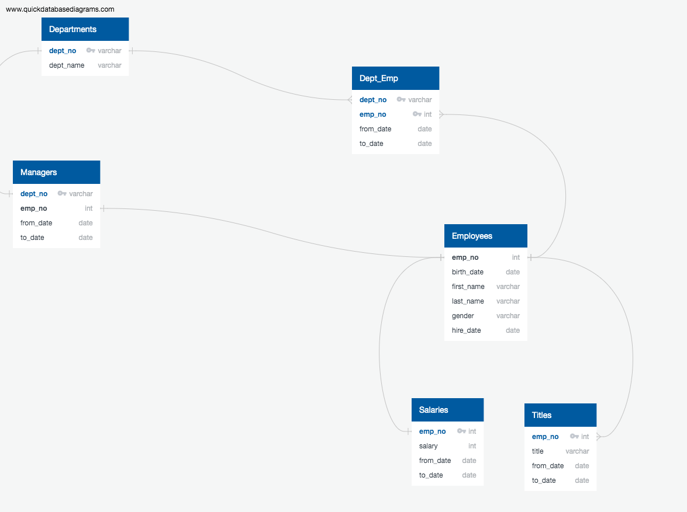

# Pewlett-Hackard-Analysis
Pewlett Hackard analysis

# Used an ERD to understand relationships between SQL tables 

I have created the The Entity Relationship Diagram which includes all correct tables and each table has the correct column names, the correct corresponding data types, Primary Keys set for each table and tables are correctly related using Foreign Keys

# The report

The ask for my analysis was to determine the total number of employees per title who will be retiring, and identify employees who are eligible to participate in a mentorship program. This information will help Bobby’s manager prepare for the “silver tsunami” as many current employees reach retirement age.

To solve the problem I created 17 tables in the EmployeeDB database.I created the tables and copied the data from the CSVs provided.Then to find the retirement eligibility,I created new tables to hold info like retirement info.I joined the departement and dept_manager table by using INNER JOIN.Then  I selected the current employeesfrom retirement_info table and joining with dept_emp. I got the employee count by department number.  41380 employees were retiring and 2382 eligible for mentorship.

I tried a lot of other variations in this process for further analysis is by taking sales and dev dept. List of Sales employee and maybe combining two departments: Sales and Developments.

# Technical Analysis to show the number of retiring employees by titles.
All my table schemas ran without error and include required columns and each table has the correct column names, the correct corresponding data types, Primary Keys set for each table and tables are correctly related using Foreign Keys. 

  
## I used NOT NULL condition on necessary columns. For eg, 
    CREATE TABLE departments (
	  dept_no VARCHAR(4) NOT NULL,
	  dept_name VARCHAR(40) NOT NULL,
	  PRIMARY KEY (dept_no),
	  UNIQUE (dept_name)
    );
## I also specified the value length for columns For eg,
    CREATE TABLE titles (
	  emp_no INT NOT NULL,
	  title VARCHAR(50) NOT NULL,
	  from_date DATE NOT NULL,
	  to_date DATE,
	  FOREIGN KEY (emp_no) REFERENCES employees (emp_no),
	  PRIMARY KEY (emp_no, title, from_date)	
    );
## I have created three new tables to show Number of titles retiring and Number of employees with each title and A list of current employees born between Jan. 1, 1952 and Dec. 31, 1955

### ret_titles CSV
### unique_titles CSV
### retiring_titles CSV

New tables are exported to CSV files, with no errors

# Technical Analysis to show the memtorship eligibility
All queries provide the expected results and all queries ran without error

## I have created a new table to show a list of current employees born between Jan. 1, 1965 and Dec. 31, 1965

### mentorship CSV

New table is exported to a CSV file, with no errors.

